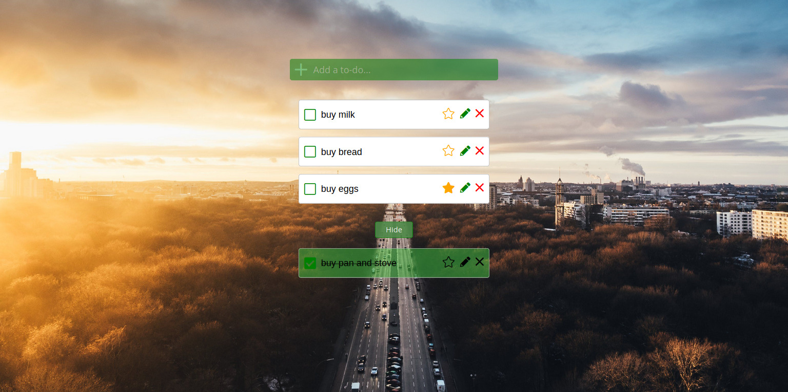

# To-Do app

To-do app with CRUD functionality.
 
[Link to project demo](https://app-todo-react.netlify.app/)
## Overview
This project was built to learn React framework basics.
 
 
The project has a single page:
1. Users can add a new task and it will appear in the pending tasks section
2. On completing a task the task is hidden from view and can be accessed by using the Show/Hide button
3. Pending tasks can be starred, edited and deleted.
4. Completed tasks can be marked incomplete again or deleted.

## Resources used
1. React framerwork was used to build the project.
2. Custom react hooks are used to handle the timer functionality.
3. The UI is styled using custom CSS.

## Possible improvements
1. Storing the to-do list in local storage for future use.

## Project screenshots

### Landing Page

